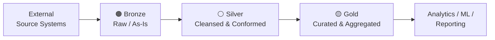
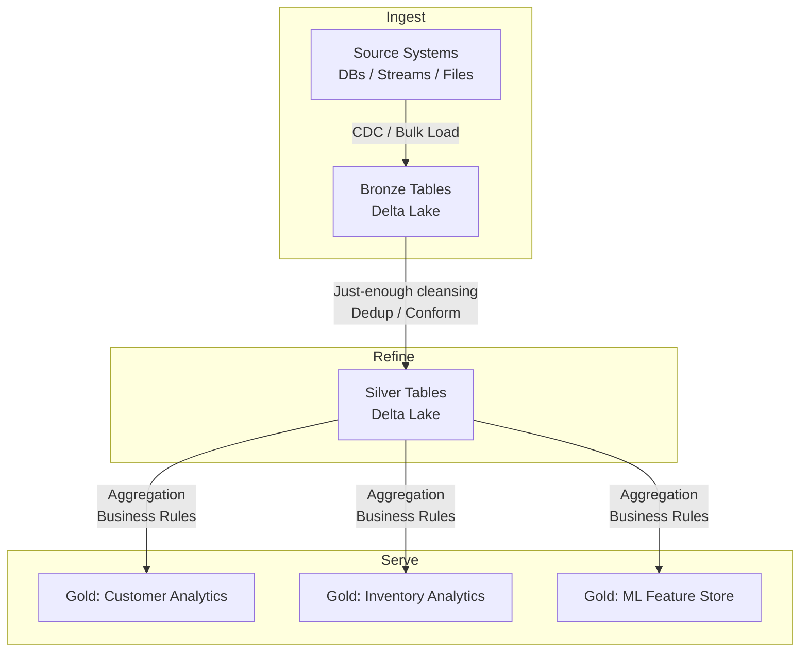

# What is Medallion Architecture? | Databricks

Medallion architecture is a data design pattern used to logically organize data in a lakehouse, incrementally improving structure and quality as data flows through three distinct layers: **Bronze**, **Silver**, and **Gold**. Sometimes called a *multi-hop architecture*, it gives teams clear, governed entry points into shared data and supports everything from raw ingestion through operational reporting and machine learning.

## Core Concept

Each layer represents a progressively higher degree of data quality and business readiness. Data is never destroyed as it moves forward — lower layers remain available for reprocessing, auditing, and lineage tracing.

## Layer Definitions

### Bronze — Raw Data

| Attribute | Detail |
|---|---|
| **Contents** | Data landed exactly as received from source systems ("as-is") |
| **Schema** | Mirrors source table structures plus metadata columns (load timestamp, process ID, etc.) |
| **Primary goals** | Change Data Capture (CDC), historical archive, lineage, auditability |
| **Storage type** | Cold/archival — avoids re-reading from source systems |

Bronze is the system of record for raw ingestion. If anything goes wrong downstream, pipelines can be replayed from Bronze without touching the originating system.

### Silver — Cleansed and Conformed Data

| Attribute | Detail |
|---|---|
| **Contents** | Matched, merged, deduplicated, and "just-enough" cleansed records |
| **Scope** | Enterprise view of key entities: master customers, stores, transactions, cross-reference tables |
| **Data modeling style** | Third Normal Form (3NF); Data Vault patterns are also common |
| **Primary consumers** | Departmental analysts, data engineers, data scientists |

Silver follows an **ELT** (not ETL) approach — minimal transformations are applied on ingest to prioritize speed and agility. Complex business rules are deferred to the Silver → Gold hop. Silver enables self-service analytics and ad-hoc reporting across the enterprise without requiring a full Gold-layer build.

### Gold — Curated Business-Level Tables

| Attribute | Detail |
|---|---|
| **Contents** | Project-specific, consumption-ready aggregates and features |
| **Data modeling style** | Kimball star schema, Inmon data marts, denormalized read-optimized models |
| **Primary consumers** | Business users, BI tools, ML model training pipelines |
| **Example domains** | Customer analytics, inventory analytics, product recommendations, marketing/sales analytics |

Gold tables have the fewest joins and the highest query performance. Final data quality rules and transformations are applied at this layer. Gold also enables *pan-EDW analytics* — combining data from multiple legacy EDWs or data marts that were previously siloed (e.g., IoT/manufacturing data joined with sales data for defect analysis, or clinical EMR data joined with financial claims data).

## Data Flow and Pipeline Mechanics

Note the **one-to-many** fan-out: a single Silver table can feed multiple Gold tables for different business domains — this is the key reuse benefit of the pattern.

On Databricks, pipelines are typically built with **Lakeflow (Spark Declarative Pipelines)**, combining:
- **Streaming tables** — backed by Apache Spark Structured Streaming for low-latency, incremental ingestion
- **Materialized views** — incrementally refreshed aggregations for Silver and Gold layers

## Benefits

- **Simple, understandable model** — clear separation of concerns between raw, refined, and serving layers
- **Incremental ETL** — only process new or changed data at each hop; no full reloads required
- **Reprocessability** — Gold and Silver tables can always be rebuilt from Bronze without touching source systems
- **ACID transactions & time travel** — Delta Lake underpins all layers, providing rollback and point-in-time queries
- **Governance & lineage** — data provenance is traceable from Gold back to the original Bronze record
- **Reuse** — shared Silver tables eliminate redundant ingestion across teams and projects

## Medallion Architecture and Data Mesh

Medallion architecture is compatible with a **data mesh** approach. Bronze and Silver tables can be owned and published by individual domain teams as data products. Downstream Gold tables in other domains consume those products, preserving the one-to-many relationship across organizational boundaries rather than just pipeline hops.

## Lakehouse Context

A lakehouse combines the scalability and openness of a data lake with the reliability and performance of a data warehouse. Medallion architecture is the canonical organizational pattern for a lakehouse — it ensures raw data is always preserved, intermediate conformed data is broadly reusable, and curated data is performant for business consumption, all on a single platform without data silos.

## Figures

*Source: [www.databricks.com](https://www.databricks.com/blog/what-is-medallion-architecture)*

## Revision log

| Date | Change |
|---|---|
| 2026-05-24 | Authored via admin. |

