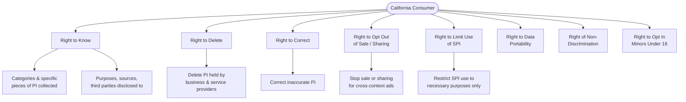
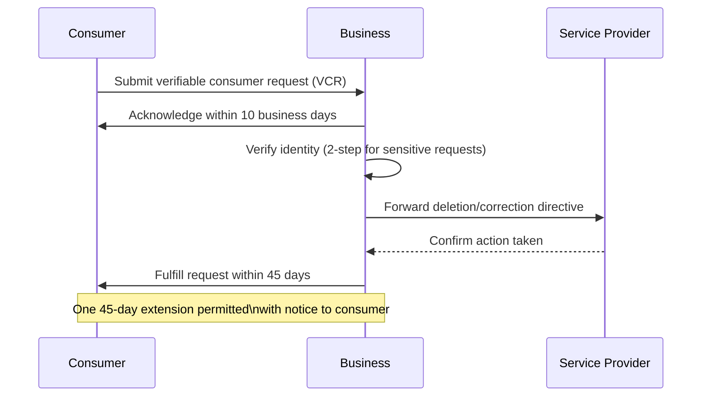

# CCPA / CPRA — California

The California Consumer Privacy Act (CCPA), significantly expanded by the California Privacy Rights Act (CPRA) effective January 1, 2023, is the most comprehensive U.S. consumer privacy statute and a foundational compliance obligation for any organization handling personal information of California residents. Unlike GDPR, it is a sectoral, opt-out-based framework rather than a consent-first regime — but its breadth of rights, enforcement powers, and operational requirements make it a tier-1 concern for MDM programs managing customer, employee, or partner data.

## Coverage Thresholds

CCPA/CPRA applies to for-profit businesses that collect personal information from California residents **and** meet **at least one** of the following thresholds:

| Threshold | Criterion |
|---|---|
| Revenue | Annual gross revenues **> $25 million** |
| Data volume | Buys, sells, receives, or shares for commercial purposes the personal information of **≥ 100,000** consumers or households per year |
| Revenue from data | Derives **≥ 50%** of annual revenues from **selling or sharing** personal information |

> **Note:** "Sharing" was added by CPRA to capture cross-context behavioral advertising even when no money changes hands — a significant expansion over the original CCPA.

Non-profits, government agencies, and businesses operating entirely outside California are generally exempt, but the practical reach is wide because "California residents" applies even when they are outside the state at the time of collection.

### Employee and B2B Data

CPRA permanently ended the temporary exemptions that excluded employee/applicant data and B2B contact information. Both categories are now fully in scope.

## Personal Information and Sensitive Personal Information

CCPA/CPRA defines **personal information (PI)** broadly: any information that identifies, relates to, describes, is reasonably capable of being associated with, or could reasonably be linked to a particular consumer or household.

CPRA introduced a new sub-category — **Sensitive Personal Information (SPI)** — that triggers additional obligations:

- Social Security, driver's license, state ID, or passport numbers
- Account log-in credentials combined with security/access codes
- Precise geolocation
- Racial or ethnic origin, religious or philosophical beliefs, union membership
- Contents of mail, email, or texts (unless the business is the intended recipient)
- Genetic data; biometric data used to uniquely identify a person
- Health information; sex life or sexual orientation

## Consumer Rights

### Right to Know (Access)
Consumers may request the **categories and specific pieces** of PI collected about them in the preceding 12 months (CPRA removed the 12-month look-back limit, enabling requests covering all data held). Businesses must respond within **45 calendar days** (extendable once by another 45 days with notice).

### Right to Delete
Consumers can request deletion of their PI. Businesses must also **direct service providers and contractors** to delete the same data. Several exceptions apply (security, legal obligation, completing a transaction, internal uses reasonably aligned with consumer expectations, etc.).

### Right to Correct
CPRA added the right to request correction of inaccurate PI. Businesses must use "commercially reasonable efforts" to correct and must direct service providers to do the same.

### Right to Opt Out of Sale / Sharing
- Businesses must post a **"Do Not Sell or Share My Personal Information"** link (or use the Global Privacy Control signal, which must be honored).
- Once opted out, the business may not re-request authorization for **12 months**.
- Minors under 16 require **opt-in** consent; under 13 requires a parent/guardian opt-in.

### Right to Limit Use of Sensitive Personal Information
Consumers can restrict SPI use to purposes **strictly necessary** for providing requested goods/services. Businesses that use SPI beyond those purposes must provide a **"Limit the Use of My Sensitive Personal Information"** link or a combined link with the opt-out right.

### Right to Data Portability
PI provided in response to a Right to Know request must be delivered in a **portable, readily usable format** that allows transmission to another entity.

### Right of Non-Discrimination
Businesses may not deny goods/services, charge different prices, or provide a different quality level solely because a consumer exercised a CCPA/CPRA right. Financial incentive programs are permissible if disclosed and the value is reasonably related to the data's value.

## Business Obligations

### Privacy Notice Requirements
- **At or before collection**: disclose categories of PI collected, purposes, whether sold/shared, and retention periods.
- **Privacy Policy**: must be comprehensive, updated at least annually, and include a description of consumer rights and how to exercise them.
- Businesses that collect SPI must disclose whether it is sold or used beyond necessary purposes.

### Data Minimization and Purpose Limitation
CPRA explicitly requires that collection, use, retention, and sharing of PI be **reasonably necessary and proportionate** to the disclosed purposes — a principle closer to GDPR's data minimization than original CCPA.

### Retention Schedules
Businesses must now disclose the **length of time** they intend to retain each category of PI, or if not determinable, the criteria used to determine retention.

### Contracts with Service Providers and Contractors
All data-sharing relationships require written contracts that:
- Specify the business purpose
- Prohibit selling/sharing data outside the contract
- Require the downstream party to notify the business of any sub-processors

### Risk Assessments and Audits
CPRA requires businesses conducting processing that presents a **significant risk** to consumer privacy to conduct and document **cybersecurity audits** and **privacy risk assessments**. Regulations from the CPPA define thresholds and content; these must be submitted to the Agency on request.

### Automated Decision-Making (ADM)
CPRA grants the CPPA authority to issue regulations on **opt-out rights for ADM** (including profiling) — rulemaking ongoing. MDM programs feeding recommendation or scoring systems should monitor this space closely.

## Obligation Timeline and Response Flow

## The California Privacy Protection Agency (CPPA)

CPRA created the **CPPA** as the first dedicated state-level privacy enforcement agency in the U.S. — a structural shift from reliance on the California Attorney General (AG).

| Attribute | Detail |
|---|---|
| Established | January 1, 2023 (operational rulemaking from 2022) |
| Authority | Rulemaking, investigation, administrative enforcement |
| Enforcement action | AG retains authority to bring civil actions in court; CPPA handles administrative proceedings |
| Maximum penalty | **$2,500 per unintentional violation; $7,500 per intentional violation** or involving a minor's data |
| Private right of action | Limited to **data breaches** involving certain categories of PI; $100–$750 per consumer per incident or actual damages (whichever is greater) |
| Cure period | Originally 30 days; CPRA removed the automatic cure period for AG actions after Jan 1, 2023 (CPPA discretionary) |

The CPPA continues to issue regulations (automated decision-making, cybersecurity audits, risk assessments, insurance) — MDM teams must track the CPPA regulatory calendar.

## CCPA/CPRA vs. GDPR — Key Differences

| Dimension | CCPA / CPRA | GDPR |
|---|---|---|
| **Legal basis for processing** | Opt-out (no pre-processing consent required for most PI) | Requires a valid lawful basis before processing |
| **Consent model** | Opt-out by default; opt-in only for SPI in certain contexts and for minors | Opt-in for most processing;

## Revision log

| Date | Change |
|---|---|
| 2026-05-24 | Authored via admin. |

