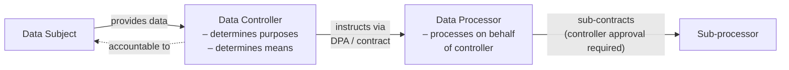
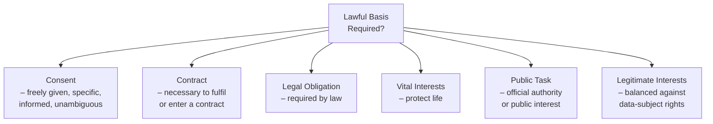
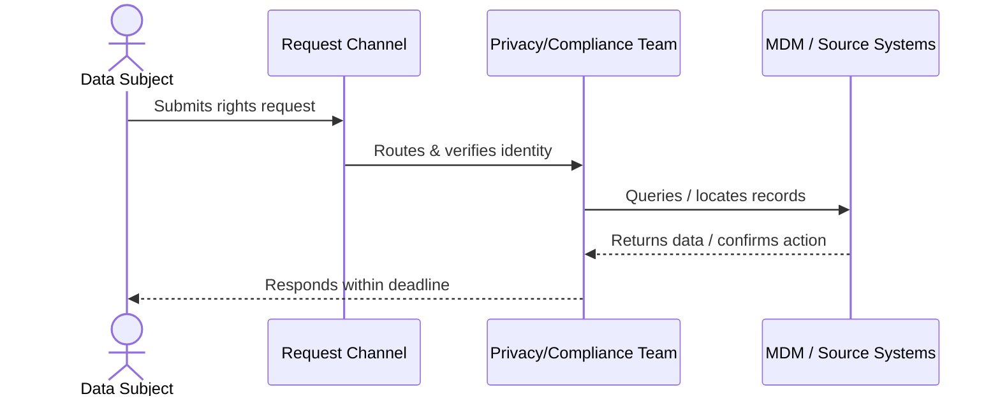

# Data Privacy — Foundations

Data privacy governs how organisations collect, use, store, share, and delete information that relates to identifiable individuals. It sits at the intersection of legal compliance, ethical responsibility, and technical architecture — meaning MDM practitioners must treat privacy not as an afterthought but as a design constraint from the start.

## What Is Personal Data?

**Personal data** (also called **Personally Identifiable Information / PII** in US-centric frameworks) is any information that can identify a living individual, either on its own or in combination with other data.

| Category | Examples |
|---|---|
| Direct identifiers | Full name, national ID number, email address, passport number |
| Indirect identifiers | Date of birth + postcode + gender (combined) |
| Online identifiers | IP address, cookie ID, device fingerprint |
| Location data | GPS coordinates, home address |
| Inferred data | Credit score derived from behaviour, health risk score |

> **Key principle:** Identifiability is contextual. Data that is anonymous in isolation may become personal when joined with another dataset — a significant concern in MDM hubs that consolidate records.

## Sensitive / Special-Category Data

Certain categories of personal data carry **heightened risk of harm** if misused and therefore attract stricter legal controls.

Common special categories under frameworks such as the EU General Data Protection Regulation (GDPR):

- Racial or ethnic origin
- Political opinions
- Religious or philosophical beliefs
- Trade-union membership
- Genetic data
- Biometric data (where used for unique identification)
- Health / medical data
- Sex life or sexual orientation

Additional categories recognised in some jurisdictions:

- Financial account details / payment card data (PCI-DSS scope)
- Social Security / national identification numbers
- Criminal conviction and offence data

Processing special-category data generally requires an explicit legal basis *and* one of the specific conditions listed in the applicable law (e.g., explicit consent, vital interests, legal claims).

## Data Controller vs. Data Processor

Understanding accountability starts with distinguishing who decides *why* and *how* data is processed from who simply acts on instructions.

| Role | Key Characteristics | Accountability |
|---|---|---|
| **Controller** | Decides *why* data is collected and *how* it is used | Primary legal accountability to data subjects and regulators |
| **Processor** | Acts only on documented controller instructions | Must not use data for own purposes; bound by Data Processing Agreement (DPA) |
| **Sub-processor** | Processor's vendor or subcontractor | Requires controller authorisation; processor remains liable |
| **Joint Controllers** | Two+ parties that jointly determine purposes/means | Must agree on respective obligations by contract |

> In MDM contexts, the organisation operating the master data hub is typically the **controller**; SaaS MDM vendors are often **processors** and must sign a DPA.

## Lawful Bases for Processing

Processing personal data is prohibited *unless* a recognised lawful basis applies. The six bases under GDPR-style frameworks are the most widely adopted reference model.

| Basis | Typical Use Case | MDM Relevance |
|---|---|---|
| **Consent** | Marketing communications, optional profiling | Must be granular; withdrawal must be technically enforceable |
| **Contract** | Order fulfilment, customer account management | Core customer master records |
| **Legal Obligation** | Tax records, AML/KYC data retention | Overrides erasure requests for mandated retention periods |
| **Vital Interests** | Emergency medical information | Rare; cannot be used to circumvent other bases |
| **Public Task** | Government registries, public health | Primarily public-sector MDM |
| **Legitimate Interests** | Fraud prevention, network security, B2B contact data | Requires a documented balancing test (LIA) |

**Important:** The chosen lawful basis must be determined *before* processing begins and documented in the Record of Processing Activities (RoPA).

## Data-Subject Rights

Individuals whose data is processed hold a bundle of enforceable rights. MDM systems are a common operational point where rights requests must be fulfilled.

### Right of Access (Subject Access Request — SAR)
- The individual may request a copy of all personal data held about them.
- Response typically required within **30 days** (extendable to 90 days for complexity under GDPR).
- MDM hubs must be capable of retrieving a complete, cross-source golden record view.

### Right to Erasure ("Right to Be Forgotten")
- Individuals can request deletion when: consent is withdrawn, data is no longer necessary, or processing was unlawful.
- **Exceptions apply**: legal obligations, freedom of expression, public interest, legal claims.
- In MDM, erasure must propagate to all linked source systems and downstream consumers.

### Right to Rectification
- Individuals can require correction of inaccurate or incomplete data.
- MDM's data-quality capabilities directly support this right — corrections in the hub should cascade to subscriber systems.

### Right to Data Portability
- Applies where processing is based on **consent** or **contract** *and* is carried out by automated means.
- Data must be provided in a structured, commonly used, machine-readable format (e.g., CSV, JSON).
- Portability enables individuals to move data to another service provider.

### Right to Object
- Individuals can object to processing based on **legitimate interests** or **public task**.
- For **direct marketing**, the objection is absolute — processing must stop.
- For other purposes, the controller must demonstrate compelling legitimate grounds to override the objection.

### Right to Restriction of Processing
- Individuals can request that processing is paused (data retained but not used) in specific circumstances:
  - Accuracy of data is contested
  - Processing is unlawful but the individual prefers restriction over erasure
  - Controller no longer needs data but individual needs it for legal claims
  - Pending assessment of an objection

### Summary Table

| Right | Trigger | Key Exceptions | MDM Impact |
|---|---|---|---|
| Access | Any request | Practically none | Full golden-record retrieval |
| Erasure | Withdrawal of consent; no longer necessary | Legal obligation; legal claims | Cross-system propagation |
| Rectification | Inaccurate/incomplete data | None significant | Data-quality stewardship |
| Portability | Consent or contract basis; automated processing | Not applicable to manual files | Machine-readable export |
| Object | Legitimate interests; direct marketing | Compelling grounds (non-marketing) | Suppression flags in master record |
| Restriction | Contested accuracy; unlawful processing | Controller still needs for claims | Status flag; processing freeze |

## Core Privacy Principles

Most modern privacy laws encode a common set of principles that should inform MDM design decisions.

- **Lawfulness, Fairness, Transparency** — individuals should know what is collected and why.
- **Purpose Limitation** — data collected for one purpose must not be repurposed without a new lawful basis.
- **Data Minimisation** — collect only what is adequate, relevant, and necessary.
- **Accuracy** — keep data correct and up to date; MDM's core value proposition directly serves this principle.
- **Storage Limitation** — retain data only as long as necessary; implement retention schedules.
- **Integrity and Confidentiality** — protect data against unauthorised access and accidental loss (security).
- **Accountability** — be able to demonstrate compliance; maintain documentation (RoPA, DPIAs, DPAs).

## Key Terminology Reference

| Term | Definition |
|---|---|
| **GDPR** | EU General Data Protection Regulation — the most influential modern privacy law |
| **RoPA** | Record of Processing Activities — mandatory inventory of processing operations |
| **DPIA** | Data Protection Impact Assessment — risk assessment for

## Revision log

| Date | Change |
|---|---|
| 2026-05-24 | Authored via admin. |

