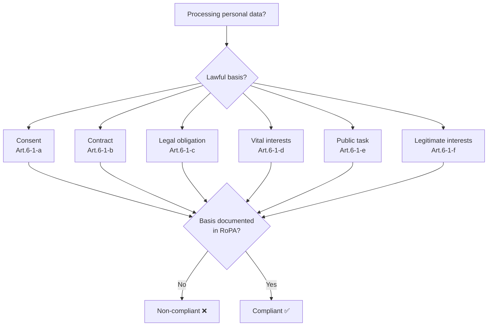
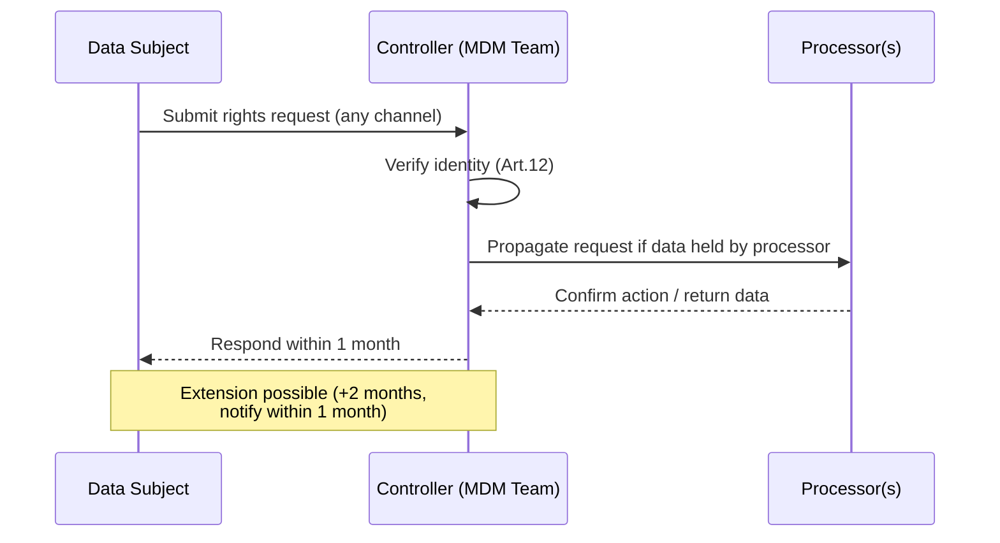
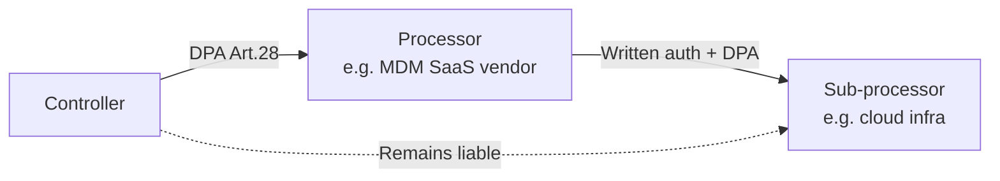

# GDPR — EU / EEA

The General Data Protection Regulation (EU) 2016/679 — in force since **25 May 2018** — is the primary legal framework governing the collection, use, and movement of personal data across the European Union and European Economic Area. For MDM practitioners, GDPR is not background noise: it directly shapes how master data is modelled, stored, enriched, shared, and retained. This page provides a structured reference to the regulation's key provisions and their practical implications.

---

## Scope

### Material Scope (Art. 2)

GDPR applies to **wholly or partly automated processing** of personal data, and to non-automated processing where data forms part of a filing system. It does **not** apply to:

- Purely personal or household activities.
- Processing by competent authorities for criminal-law purposes (covered separately by the Law Enforcement Directive 2016/680).
- National security / defence activities outside Union law.

### Territorial Scope (Art. 3)

GDPR has an intentionally wide extraterritorial reach:

| Trigger | Who is covered |
|---|---|
| **Establishment principle** — controller or processor established in EU/EEA | All processing carried out in context of that establishment, regardless of where processing occurs |
| **Targeting principle** — no EU establishment, but offering goods/services to EU data subjects, or monitoring their behaviour | That non-EU/EEA controller or processor |

> **MDM implication:** A US-headquartered company running a global customer MDM hub that targets EU consumers is in scope even if no server sits in the EU.

---

## Core Principles (Art. 5)

All personal data processing must comply with the following principles. Violations at this level attract the **upper-tier fine** (see Enforcement).

| Principle | In practice |
|---|---|
| **Lawfulness, fairness, transparency** | Processing must have a lawful basis; data subjects must be informed |
| **Purpose limitation** | Data collected for specified, explicit, legitimate purposes; no incompatible secondary use |
| **Data minimisation** | Adequate, relevant, and limited to what is necessary |
| **Accuracy** | Kept up to date; reasonable steps to erase or rectify inaccurate data promptly |
| **Storage limitation** | Not kept longer than necessary; retention schedules required |
| **Integrity and confidentiality** | Appropriate security against unauthorised access, loss, destruction |
| **Accountability** | Controller must be **able to demonstrate** compliance — not merely claim it |

---

## Lawful Bases for Processing (Art. 6)

A controller must identify **one** lawful basis before processing begins. The basis must be documented and communicated to data subjects.

| Basis | Key conditions / notes |
|---|---|
| **Consent** (a) | Freely given, specific, informed, unambiguous; withdrawable at any time without detriment |
| **Contract** (b) | Processing necessary to perform a contract with — or at request of — the data subject |
| **Legal obligation** (c) | Processing required by EU or Member State law (e.g., tax, employment records) |
| **Vital interests** (d) | To protect life; narrow scope — typically emergency situations |
| **Public task** (e) | Exercise of official authority or public interest task laid down by law |
| **Legitimate interests** (f) | Controller's or third-party interests, balanced against data subject rights (LIA required); **not available to public authorities** in exercise of tasks |

> **MDM implication:** Customer golden records typically rely on **contract** or **legitimate interests**; B2B contact data often uses legitimate interests. Document the basis in your Record of Processing Activities.

---

## Special-Category Data (Art. 9) and Criminal Data (Art. 10)

Special-category data carries **heightened protection** and requires both an Art. 6 lawful basis and a **separate Art. 9 condition**.

**Categories (Art. 9(1)):**
- Racial or ethnic origin
- Political opinions
- Religious or philosophical beliefs
- Trade-union membership
- Genetic data
- Biometric data (where used to uniquely identify)
- Health data
- Sex life or sexual orientation

**Art. 9(2) conditions include:** explicit consent, employment/social security law obligations, vital interests, legitimate activities of not-for-profit bodies, data manifestly made public by the subject, legal claims, substantial public interest (by Union or Member State law), medical/health purposes, public health, archiving/research/statistics.

**Art. 10 — Criminal conviction data** may only be processed under official authority or when authorised by Member State law.

> **MDM implication:** Many MDM platforms allow arbitrary attribute storage; governance must explicitly **prohibit** ingestion of Art. 9 attributes unless a compliant condition exists and is documented.

---

## Data-Subject Rights

Controllers must facilitate these rights without undue delay and, in most cases, within **one calendar month** (extendable by two further months for complexity).

| Right | Article | Key notes |
|---|---|---|
| **Transparency / information** | 13–14 | Provided at collection or within 1 month (indirect collection) |
| **Access** | 15 | Copy of data + supplementary information; first copy free |
| **Rectification** | 16 | Correct inaccurate or incomplete data |
| **Erasure ("right to be forgotten")** | 17 | Applies where basis lapses, consent withdrawn, data no longer necessary, etc. |
| **Restriction of processing** | 18 | Data held but not actively used during a dispute or pending erasure |
| **Data portability** | 20 | Machine-readable copy where basis is consent or contract + automated processing |
| **Object** | 21 | Absolute right to object to direct marketing; qualified right vs. legitimate interests / public task |
| **Automated decisions / profiling** | 22 | Right not to be subject to solely automated decisions with significant effect; exceptions require safeguards |

---

## Controller and Processor Obligations

### Controller (Art. 4(7), Art. 24)

The entity that **determines purposes and means** of processing. Core obligations:

- Implement appropriate technical and organisational measures (TOMs).
- Conduct **Data Protection Impact Assessments** (DPIA, Art. 35) for high-risk processing.
- Apply **data protection by design and by default** (Art. 25).
- Appoint a DPO where required (Art. 37).
- Maintain Records of Processing Activities (Art. 30).
- Report personal data breaches to supervisory authority within **72 hours** (Art. 33) and notify data subjects without undue delay where high risk (Art. 34).

### Processor (Art. 4(8), Art. 28)

The entity processing **on behalf of** the controller. Core obligations:

- Act **only on documented instructions** of the controller.
- Ensure persons authorised to process are under confidentiality obligation.
- Implement security measures (Art. 32).
- **Not sub-process without prior written authorisation** from the controller.
- Assist controller with DPIA, audits, breach notification.
- Delete or return data on termination of services.
- A **Data Processing Agreement (DPA)** is mandatory — its minimum contents are prescribed by Art. 28(3).

### Controller–Processor–Sub-processor chain

---

## Data Protection Officer (Art. 37–39)

### When mandatory

- Public authorities / bodies (except courts).
- Controllers or processors

## Revision log

| Date | Change |
|---|---|
| 2026-05-24 | Authored via admin. |

