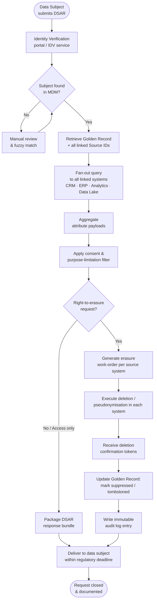
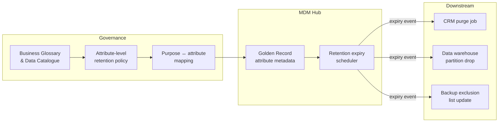

# MDM × Privacy — how master data operationalizes compliance

Privacy regulation turns abstract rights into operational obligations: find every byte about a person, prove you deleted it, honour the consent they gave, and never move data somewhere it is not allowed to go. Without a single authoritative view of each data subject, these obligations become guesswork. Master Data Management supplies that authoritative view — the **golden record** — and the surrounding plumbing that makes privacy rights mechanically enforceable rather than aspirationally documented.

## The Golden Record as the Unified Data-Subject View

A golden record is the MDM system's best-resolved, de-duplicated representation of a real-world entity. For privacy purposes the entity is a **data subject**: a customer, employee, patient, or any natural person whose data the organisation holds.

Key properties that make the golden record the privacy compliance anchor:

| Property | Privacy relevance |
|---|---|
| Single survivorship-ruled identity | One canonical subject ID maps every downstream copy back to one source of truth |
| Cross-domain linkage | Associates the same individual across CRM, ERP, marketing, support, analytics |
| Attribute provenance | Records which source system contributed each attribute value |
| Change history / audit trail | Preserves who changed what and when — needed for regulator evidence |
| Party relationship model | Captures household, guardian, or legal-entity relationships that affect rights scope |

Without MDM, a DSAR (Data Subject Access Request) requires manually hunting across every system with no guarantee of completeness. With MDM, the golden-record ID is the join key that drives an automated, auditable response.

## DSAR and Right-to-Access Workflow

When a data subject exercises access rights (GDPR Art. 15, CCPA §1798.110, etc.) the MDM golden record is the starting point: identify the subject, resolve all aliases, then fan out to every system of record.

**Key design decisions visible in the flow:**

- **Identity verification before record retrieval** — prevents fraudulent erasure of someone else's data.
- **Fan-out driven by source-system linkage in MDM** — the golden record's cross-reference table defines the scope; if a system is not linked, it is in scope for a gap-analysis ticket.
- **Confirmation tokens collected** — erasure is only provable when each linked system returns a verifiable signal; MDM aggregates these into one audit record.
- **Tombstone vs. hard delete** — the golden record itself is often retained in a suppressed/tombstoned state so re-ingestion from source systems does not accidentally recreate the profile (known as the "zombie record" problem).

## Right-to-Erasure Findability

The regulation does not accept "we think we deleted it." Erasure must be provable, and provability requires knowing every copy.

MDM provides this through three mechanisms:

1. **Cross-reference / alias table** — every internal system ID, every email hash, every cookie ID that has ever been resolved to the golden record is stored. The erasure work-order is generated from this list, not from ad-hoc memory.
2. **Data lineage integration** — MDM feeds or integrates with a lineage tool (e.g., Collibra Lineage, Informatica CLAIRE, Apache Atlas) to track downstream derivations: BI extracts, ML training sets, data-warehouse snapshots that were built from the golden record.
3. **Retention schedule linkage** — each attribute or attribute group carries a retention class; the MDM hub publishes expiry events that trigger deletion jobs in downstream stores, closing the loop without human intervention.

> **Practical gap:** Backup tapes and analytical snapshots are the hardest to erase. MDM cannot delete a tape, but it *can* generate a suppression record that prevents the data from being re-surfaced if the backup is ever restored. This is the accepted regulatory approach in most jurisdictions when technical deletion is disproportionately burdensome.

## Consent Metadata Travelling with the Golden Record

Consent is an attribute of the relationship between the data subject and the organisation, not of any single transaction. MDM is the natural home for it.

A consent model attached to the golden record typically includes:

| Metadata field | Purpose |
|---|---|
| `consent_id` | Immutable reference to the consent capture event |
| `purpose_code` | Controlled vocabulary: `MARKETING_EMAIL`, `PROFILING`, `THIRD_PARTY_SHARE`, etc. |
| `legal_basis` | `CONSENT` / `CONTRACT` / `LEGITIMATE_INTEREST` / `LEGAL_OBLIGATION` |
| `granted_at` | ISO-8601 timestamp |
| `expires_at` | Nullable; drives automated withdrawal |
| `channel` | Where consent was captured (web, IVR, in-store) |
| `version` | Notice version shown at time of capture |
| `withdrawn_at` | Populated on opt-out; triggers downstream suppression events |

When downstream systems (email platform, ad-tech, analytics) query the MDM hub before processing, they receive the current consent state as part of the golden-record payload. This means:

- A marketing suppression does not have to be manually propagated to 12 systems — the canonical signal lives in one place.
- Consent withdrawal triggers an MDM event that all subscribed systems consume via pub/sub.
- Auditors can reconstruct the consent state at any historical point using the audit trail.

## Data Minimisation and Retention Enforced at the Master Level

**Data minimisation** (collect only what is necessary for a declared purpose) and **storage limitation** (keep it only as long as necessary) are easier to enforce when the definition of "necessary" lives in the data governance layer that MDM references.

MDM operationalises both:

Concrete enforcement points:

- **Attribute suppression rules** — an MDM policy can mask or null out attributes (e.g., full date-of-birth → birth year) once the original precision is no longer needed.
- **Retention-class inheritance** — child records (orders, interactions) inherit the parent subject's retention class; when the golden record is suppressed, related records are automatically scheduled.
- **Minimisation at ingest** — MDM survivorship rules can be configured to not promote certain attributes (e.g., highly sensitive health indicators) to the golden record at all, leaving them partitioned in a higher-classification store.

## Cross-Border Transfer Mapping via Data Lineage

Transferring personal data across jurisdictions requires a lawful transfer mechanism (SCCs, adequacy decision, BCRs) and — critically — **knowing that the transfer is happening**. Many organisations discover cross-border transfers only when a regulator asks.

MDM combined with data lineage provides the discovery layer:

| Layer | Contribution |
|---|---|
| MDM golden record | Tags the data subject's residency / citizenship jurisdiction on the record |
| Data catalogue / lineage | Maps physical data flows: which pipelines move golden-record-derived data, and to which infrastructure regions |
| Policy engine (e.g., ABAC) | Evaluates transfer rules at query time: EU resident data → US analytics cluster requires valid SCC |
| MDM event log | Provides audit evidence of what data left which jurisdiction and when |

A **data residency attribute** on the golden record (e.g., `gdpr_region: EEA`, `lgpd_subject: true`) allows downstream pipelines and cloud storage policies to enforce routing rules automatically — routing

## Revision log

| Date | Change |
|---|---|
| 2026-05-25 | Authored via admin. |

