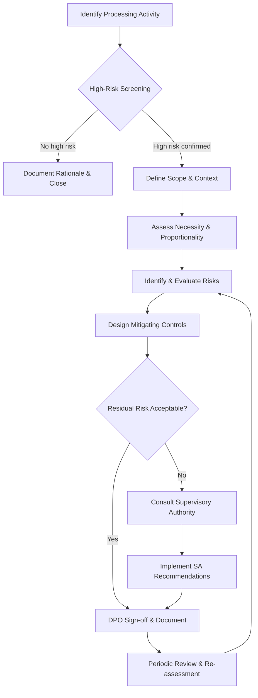
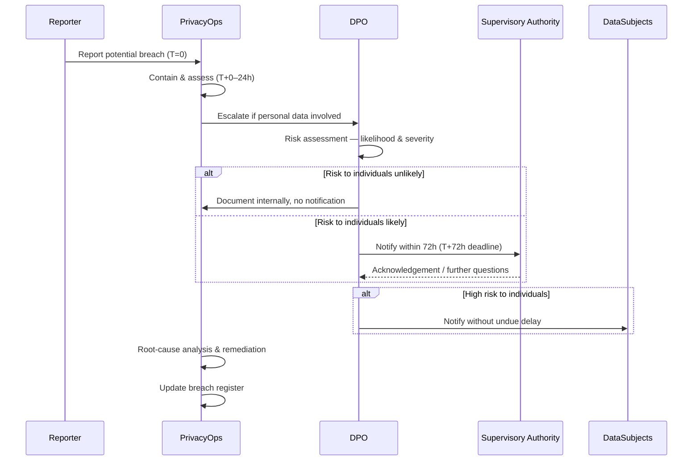

# Privacy Operations — DPIA, RoPA, breach response, transfers

Privacy Operations covers the day-to-day practices that keep a data-privacy program compliant and audit-ready. This page focuses on four core operational pillars: Data Protection Impact Assessments (DPIAs), Records of Processing Activities (RoPA), data-breach response, and cross-border transfer mechanisms. Each section includes practical checklists and decision aids.

---

## Data Protection Impact Assessments (DPIAs)

A DPIA is a structured risk assessment required before starting any processing that is "likely to result in a high risk" to individuals. Under GDPR Article 35, a DPIA is **mandatory** — not optional — in specific circumstances.

### When a DPIA Is Required

| Trigger | Example |
|---|---|
| Systematic profiling with legal/significant effect | Credit scoring, insurance pricing |
| Large-scale processing of special-category data | Health records, biometrics |
| Systematic monitoring of publicly accessible areas | CCTV, Wi-Fi tracking |
| Innovative technology or novel use of existing tech | AI inference on personal data |
| Processing that prevents individuals from exercising rights | Automated blacklisting |
| Data matching or combining datasets | Cross-silo identity linking in MDM |
| Vulnerable data subjects | Children, patients, employees |

> **Tip:** Many DPAs publish their own "blacklists" of processing that always requires a DPIA. Check the relevant national authority's list (e.g., CNIL, ICO, BfDI) in addition to the GDPR Article 35(3) criteria.

### DPIA Lifecycle



### DPIA Content Checklist

- [ ] **Description of processing** — purposes, categories of data, data subjects, recipients, retention periods
- [ ] **Necessity & proportionality** — lawful basis, data minimisation, storage limitation
- [ ] **Risk assessment** — likelihood × severity matrix for each identified risk
- [ ] **Mitigating controls** — technical (encryption, pseudonymisation) and organisational (policies, training)
- [ ] **DPO consultation record** — date, opinion, outcome
- [ ] **Supervisory authority consultation** (if residual risk remains high)
- [ ] **Review schedule** — trigger events and periodic date
- [ ] **Sign-off** — business owner, legal/privacy, DPO

---

## Records of Processing Activities (RoPA)

A RoPA is the inventory required under GDPR Article 30 for controllers and processors. It is the **single source of truth** for what personal data exists, why, how long it's kept, and who has access.

### RoPA Applicability

- **Controllers** with ≥ 250 employees *or* whose processing is not occasional *or* involves special-category/criminal-offence data.
- **Processors** maintain a parallel record of processing carried out on behalf of each controller.
- In practice, most organisations maintain a RoPA regardless of size as a baseline privacy hygiene measure.

### RoPA Data Model (Minimum Fields)

| Field | Controller Record | Processor Record |
|---|---|---|
| Processing activity name | ✅ | ✅ |
| Controller / Processor name & contact | ✅ | ✅ |
| DPO contact details | ✅ | ✅ |
| Purpose of processing | ✅ | — |
| Lawful basis | ✅ | — |
| Categories of data subjects | ✅ | ✅ |
| Categories of personal data | ✅ | ✅ |
| Recipients / categories of recipients | ✅ | ✅ |
| Third-country transfers & safeguards | ✅ | ✅ |
| Retention / erasure schedule | ✅ | ✅ |
| Security measures (general description) | ✅ | ✅ |
| Sub-processor details | — | ✅ |

### RoPA Maintenance Best Practices

- **Integrate with change management** — any new system, vendor onboarding, or process change triggers a RoPA update.
- **Link to DPIAs** — each high-risk activity in the RoPA should reference its DPIA.
- **Map data flows** — use the RoPA as input to data-flow diagrams; MDM golden records typically appear as a recipient across many source-system entries.
- **Owner accountability** — assign a named business owner per processing activity, not just a privacy team owner.
- **Annual audit cycle** — review all records for accuracy; flag stale entries for decommissioning.

---

## Data-Breach Response

A personal data breach must be handled on a tight timeline. GDPR Article 33 requires notification to the supervisory authority **within 72 hours** of becoming aware; Article 34 may require notification to affected individuals **without undue delay**.

### Breach Response Workflow



### 72-Hour Notification Clock

| Phase | Timeframe | Key Actions |
|---|---|---|
| Detection & triage | T+0 to T+4h | Confirm incident, activate response team, contain |
| Assessment | T+4h to T+24h | Determine data affected, number of subjects, risk level |
| Internal notification | T+24h | Inform DPO, legal counsel, executive sponsor |
| SA notification draft | T+24h to T+48h | Prepare Article 33 notification content |
| SA notification submit | By T+72h | Submit — can be phased if full info not yet available |
| Individual notification | ASAP after SA if high-risk | Prepare clear, plain-language communication |

> **"Without undue delay" for individuals** has no fixed hour count but regulators expect it within days, not weeks, of confirming the breach.

### SA Notification Content (Article 33(3))

- [ ] Nature of the breach (categories and approximate number of data subjects and records)
- [ ] Name and contact details of the DPO
- [ ] Likely consequences of the breach
- [ ] Measures taken or proposed to address the breach
- [ ] If information is not available at T+72h, state what is known and confirm further details to follow ("phased notification")

### Breach Register (Article 33(5) Requirement)

Maintain an internal log of **all** breaches — including those below the notification threshold — containing:

- Date/time of breach and of discovery
- Nature of breach and data involved
- Risk assessment outcome
- Notification decisions and dates
- Remediation actions and completion status

---

## Cross-Border Transfer Mechanisms

Transferring personal data outside the EEA (or equivalent restricted zone under other laws) requires a valid **transfer mechanism** under GDPR Chapter V.

### Transfer Mechanism Decision Tree

```mermaid
flowchart TD
    A[Intended Transfer to Third Country] --> B{Adequacy Decision in Place?}
    B -- Yes --> C[Transfer Permitted — Document Basis]
    B -- No --> D{BCRs Approved?}
    D -- Yes --> E[Transfer Under BCRs — Maintain BCR Register]
    D -- No --> F{SCCs / IDTAs Available?}
    F -- Yes --> G[Execute SCCs/IDTAs — Conduct TIA]
    F -- No --> H{Derogation Applies?}
    H -- Yes --> I[Apply Derogation — Document Carefully]
    H -- No

## Revision log

| Date | Change |
|---|---|
| 2026-05-25 | Authored via admin. |

